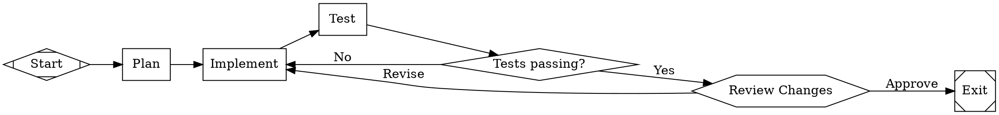
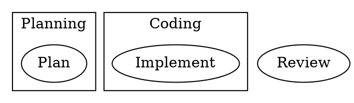

# attractor

A DOT-based pipeline runner for multi-stage AI workflows.

[](https://github.com/bkrabach/attractor/actions)
[](LICENSE)

## Features

- **DOT parser** -- Parse standard Graphviz DOT digraphs into a typed graph model with node attributes, edge conditions, and graph-level configuration
- **Validation** -- Built-in lint rules check for missing start/exit nodes, unreachable nodes, ambiguous edges, and structural issues
- **Execution engine** -- Walk the graph from start to exit, dispatching each node to the appropriate handler
- **Handler system** -- Shape-based handler resolution with a registry for custom handlers
- **Condition expressions** -- Edge conditions like `outcome=success` or `outcome!=fail` control branching
- **Human-in-the-loop** -- `wait.human` nodes pause execution and present choices to a pluggable `Interviewer`
- **Parallel execution** -- `component` nodes fan out to parallel branches; `tripleoctagon` nodes fan in and join
- **Retry** -- Per-node `max_retries` with configurable backoff; graph-level `retry_target` for goal gate failures
- **Goal gates** -- Nodes marked `goal_gate=true` must succeed before the pipeline can exit
- **Checkpointing** -- Automatic checkpoint after each node; resume interrupted pipelines from where they stopped
- **Model stylesheet** -- CSS-like rules that assign models and parameters to nodes by class or ID
- **Variable expansion** -- `$goal` in prompts is replaced with the graph-level goal attribute
- **Pipeline events** -- Broadcast channel for real-time observation of node execution, retries, and completion
- **AST transforms** -- Transform pipeline to expand variables and apply stylesheets before execution

## Quick Start

Clone and build:

```sh
git clone https://github.com/bkrabach/attractor.git
cd attractor
cargo build
```

Parse a DOT pipeline, validate it, and run it:

```rust
use attractor::{PipelineRunner, RunConfig, parse_dot, validate};

#[tokio::main]
async fn main() -> Result<(), Box<dyn std::error::Error>> {
    let dot = r#"
        digraph MyPipeline {
            graph [goal="Build and test the project"]
            start [shape=Mdiamond]
            exit  [shape=Msquare]
            plan  [label="Plan", prompt="Create an implementation plan for: $goal"]
            build [label="Build", prompt="Implement the plan"]
            start -> plan -> build -> exit
        }
    "#;

    let (runner, mut events) = PipelineRunner::builder().build();

    // Optionally listen to events
    tokio::spawn(async move {
        while let Ok(event) = events.recv().await {
            println!("[pipeline] {:?}", event);
        }
    });

    let result = runner.run(dot, RunConfig::new("/tmp/pipeline-logs")).await?;
    println!("Status: {:?}", result.status);
    println!("Completed nodes: {:?}", result.completed_nodes);
    Ok(())
}
```

By default the runner operates in **simulation mode** -- codergen nodes return synthetic responses without calling an LLM. To connect a real backend, see [Custom Handler / CodergenBackend](#custom-handler--codergenbackend) below.

## DOT Pipeline Example

A complete pipeline with branching, retry, and a human gate:



Run it:

```rust
use attractor::{PipelineRunner, RunConfig};

let dot = include_str!("pipeline.dot");
let (runner, _events) = PipelineRunner::builder().build();
let result = runner.run(dot, RunConfig::new("./logs")).await?;
```

## Handler Types

Each node shape maps to a handler type. The engine resolves handlers in priority order: explicit `type` attribute, then shape-based lookup, then the default handler.

| Shape | Handler Type | Description |
|---|---|---|
| `Mdiamond` | `start` | Pipeline entry point; initializes context |
| `Msquare` | `exit` | Pipeline exit; triggers goal gate checks |
| `box` | `codergen` | LLM task node; calls `CodergenBackend` with the node's prompt |
| `diamond` | `conditional` | Evaluates outgoing edge conditions against context |
| `hexagon` | `wait.human` | Pauses for human input via the `Interviewer` trait |
| `component` | `parallel` | Fans out to parallel branches |
| `tripleoctagon` | `parallel.fan_in` | Joins parallel branches with configurable policy |
| `parallelogram` | `tool` | Executes a deterministic tool/script |
| `house` | `stack.manager_loop` | Manager-worker loop pattern |

Override shape-based resolution with an explicit `type` attribute:

```dot
my_node [shape=box, type="wait.human", label="Custom Gate"]
```

## Human-in-the-Loop

Nodes with `shape=hexagon` (or `type="wait.human"`) pause the pipeline and present the outgoing edge labels as choices to an `Interviewer`. The pipeline resumes along the chosen edge.

Built-in interviewers:

- `AutoApproveInterviewer` -- Always picks the first option (default; useful for testing)
- `CallbackInterviewer` -- Delegates to an async callback function
- `QueueInterviewer` -- Pre-loaded answer queue for deterministic testing
- `RecordingInterviewer` -- Wraps another interviewer and records all Q&A pairs

```rust
use std::sync::Arc;
use attractor::{PipelineRunner, RunConfig, CallbackInterviewer, Answer, AnswerValue};

let interviewer = Arc::new(CallbackInterviewer::new(|question| {
    Box::pin(async move {
        println!("Pipeline asks: {}", question.text);
        for opt in &question.options {
            println!("  [{}] {}", opt.key, opt.label);
        }
        // Auto-approve
        Ok(Answer {
            value: AnswerValue::Choice(question.options[0].key.clone()),
            rationale: Some("Looks good".into()),
        })
    })
}));

let (runner, _events) = PipelineRunner::builder()
    .with_interviewer(interviewer)
    .build();

let result = runner.run(dot, RunConfig::new("./logs")).await?;
```

## Custom Handler / CodergenBackend

The `CodergenBackend` trait is the integration point for connecting an LLM (or a `coding-agent-loop` Session) to the pipeline engine. Implement it to control how `shape=box` nodes are executed.

```rust
use async_trait::async_trait;
use attractor::{
    CodergenBackend, CodergenResult, CodergenHandler, PipelineRunner,
    Context, Node, EngineError,
};
use std::sync::Arc;

struct MyLlmBackend {
    // ... your LLM client, agent session, etc.
}

#[async_trait]
impl CodergenBackend for MyLlmBackend {
    async fn run(
        &self,
        node: &Node,
        prompt: &str,
        context: &Context,
    ) -> Result<CodergenResult, EngineError> {
        // Call your LLM, run an agent session, etc.
        let response = format!("Completed: {}", node.id);
        Ok(CodergenResult::Text(response))
    }
}

let backend: Box<dyn CodergenBackend> = Box::new(MyLlmBackend { /* ... */ });
let handler = Arc::new(CodergenHandler::new(Some(backend)));

let (runner, _events) = PipelineRunner::builder()
    .with_handler("codergen", handler)
    .build();
```

Return `CodergenResult::Outcome(outcome)` to directly control the node's success/fail/retry status instead of returning plain text.

## Condition Expressions

Edge conditions control branching at `diamond` (conditional) nodes and are evaluated against the pipeline context.

Supported operators:

| Expression | Meaning |
|---|---|
| `outcome=success` | Previous node outcome equals "success" |
| `outcome!=fail` | Previous node outcome does not equal "fail" |
| `ctx.key=value` | Context variable equals value |

```dot
gate [shape=diamond, label="Check result"]
gate -> happy_path [condition="outcome=success"]
gate -> retry_path [condition="outcome!=success"]
```

Edges are evaluated in declaration order. The first matching edge is taken. If no condition matches and there is an unconditional edge, it serves as the default.

## Model Stylesheet

A CSS-like stylesheet assigns models and parameters to nodes by class or ID, keeping prompt logic separate from model selection.



Nodes in the "Planning" subgraph receive class `planning`; nodes in "Coding" receive class `coding`. The stylesheet is applied as an AST transform before execution.

## Checkpoint and Resume

The engine writes a checkpoint after each node completes. If a pipeline is interrupted, resume from where it left off:

```rust
use attractor::{PipelineRunner, RunConfig};

let dot = include_str!("pipeline.dot");
let config = RunConfig::new("./logs");
let (runner, _events) = PipelineRunner::builder().build();

// First run -- interrupted or failed partway through
let _ = runner.run(dot, config.clone()).await;

// Resume from checkpoint
let result = runner.resume(dot, config).await?;
println!("Resumed pipeline completed: {:?}", result.status);
```

Checkpoints are stored as JSON in the `logs_root` directory and contain:

- Current node ID
- Completed node list
- Per-node retry counts
- Full context snapshot
- Execution logs

## Pipeline Events

Subscribe to a broadcast channel to observe pipeline execution in real time:

```rust
use attractor::{PipelineRunner, PipelineEvent, RunConfig};

let (runner, mut events) = PipelineRunner::builder().build();

tokio::spawn(async move {
    while let Ok(event) = events.recv().await {
        match event {
            PipelineEvent::NodeStarted { node_id, .. } => {
                println!("Starting: {node_id}");
            }
            PipelineEvent::NodeCompleted { node_id, status, .. } => {
                println!("Completed: {node_id} -> {status:?}");
            }
            PipelineEvent::PipelineFailed { error, .. } => {
                eprintln!("Pipeline failed: {error}");
            }
            _ => {}
        }
    }
});
```

## Architecture

```
DOT source
    |
    v
+-------------------+
|  Parser           |  parse_dot() -> Graph
+-------------------+
    |
    v
+-------------------+
|  Transforms       |  Variable expansion, stylesheet application
+-------------------+
    |
    v
+-------------------+
|  Validator        |  Lint rules -> Diagnostic[]
+-------------------+
    |
    v
+-------------------+
|  Execution Engine |  PipelineRunner::run() / resume()
|  (walk the graph) |
+---+-------+-------+
    |       |
    v       v
+-------+ +-------------+
|Handler| |  Interviewer |  (for wait.human nodes)
|Registry| +-------------+
+---+---+
    |
    +---> StartHandler, ExitHandler, CodergenHandler,
          ConditionalHandler, WaitForHumanHandler,
          ParallelHandler, FanInHandler, ToolHandler,
          ManagerLoopHandler
```

The engine lifecycle for each `run()` call:

```
PARSE -> TRANSFORM -> VALIDATE -> INITIALIZE -> EXECUTE -> FINALIZE
```

During execution, the engine walks the graph node by node:

1. Resolve the handler for the current node (type attribute > shape > default)
2. Execute the handler, producing an `Outcome` (success/fail/retry + context updates)
3. Write checkpoint
4. Select the next edge based on the outcome and edge conditions
5. Repeat until an exit node is reached or an error occurs

## Dependencies

- [coding-agent-loop](https://github.com/bkrabach/coding-agent-loop) -- Autonomous coding agent loop
- [unified-llm](https://github.com/bkrabach/unified-llm) -- LLM client library

## NLSpec

Implemented from the [Attractor NLSpec](https://github.com/bkrabach/attractor).

## License

MIT
